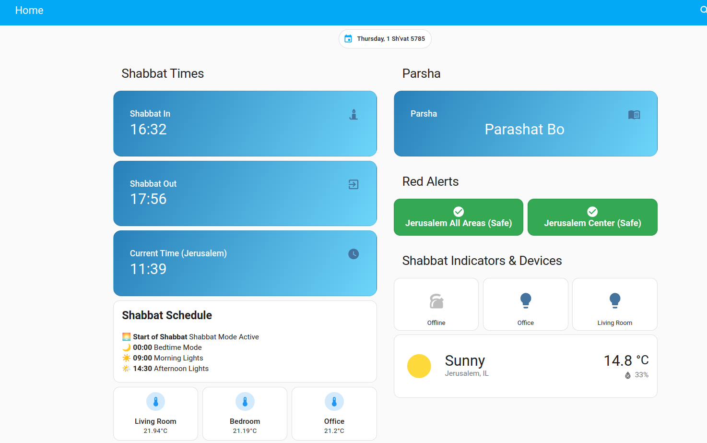
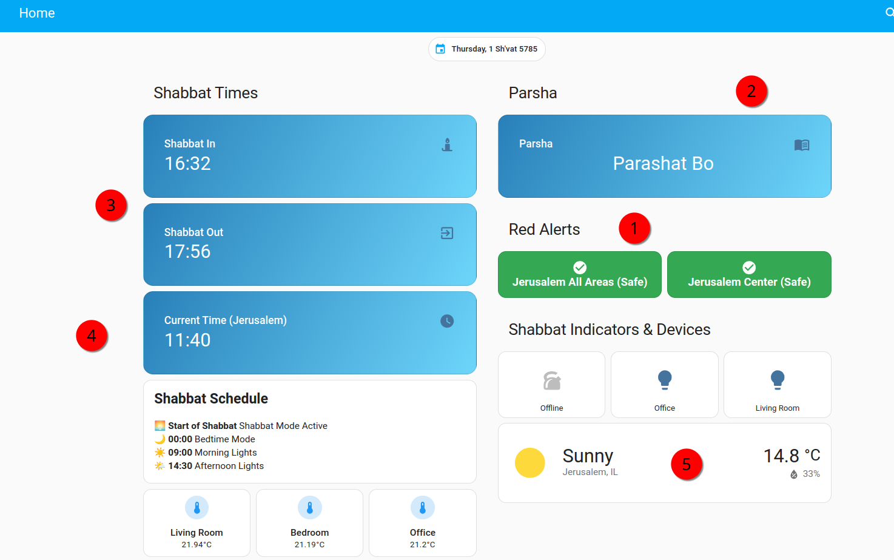

# Home Assistant Shabbat / Yom Tov Dashboard (Jan 2025)

## Display Dashboard

## Sensors / Add-ons Used

| Sensor Name                                      | Source                          | Description                                                                 | Add-on Link                               |
|--------------------------------------------------|---------------------------------|-----------------------------------------------------------------------------|-------------------------------------------|
| `sensor.hebcal_start_of_shabbat`                 | Hebcal                          | Tracks the start time of Shabbat.                                           | [Jewish Calendar](https://www.home-assistant.io/integrations/jewish_calendar/) |
| `sensor.hebcal_end_of_shabbat`                   | Hebcal                          | Tracks the end time of Shabbat.                                             | [Jewish Calendar](https://www.home-assistant.io/integrations/jewish_calendar/) |
| `sensor.time`                                    | System                          | Displays the current time in Jerusalem.                                     | N/A                                      |
| `sensor.hebcal_parsha`                           | Hebcal                          | Displays the weekly Torah portion (Parsha).                                 | [Jewish Calendar](https://www.home-assistant.io/integrations/jewish_calendar/) |
| `binary_sensor.oref_alert_jerusalem_all_areas`   | OREF (Red Alert System)         | Indicates if there is a red alert for all areas in Jerusalem.               | [Red Alert](https://github.com/idodov/RedAlert)    |
| `binary_sensor.oref_alert`                       | OREF (Red Alert System)         | Indicates if there is a red alert for the Jerusalem Center area.            | [Red Alert](https://github.com/idodov/RedAlert)   |
| `sensor.hebcal_hebrew_date`                      | Hebcal                          | Displays the current Hebrew date.                                           | [Jewish Calendar](https://www.home-assistant.io/integrations/jewish_calendar/) |
| `weather.ims_weather`                            | IMS (Israel Meteorological Service) | Provides weather forecast data for Jerusalem.                               | N/A |
 
 ## Dashboard Configuration (YAML)

 See `dashboard.yaml`

 ## Documentation

*   Configuring Red Alerts: [https://medium.com/daniels-tech-world/integrating-israeli-rocket-alerts-red-alerts-into-home-assistant-508a2511dbac](https://medium.com/daniels-tech-world/integrating-israeli-rocket-alerts-red-alerts-into-home-assistant-508a2511dbac)
*   Configuring Shabbat & Yom Tov automations: [https://heyitworks.tech/home-assistant-automations-for-yom-tov-shabbat-observance](https://heyitworks.tech/home-assistant-automations-for-yom-tov-shabbat-observance)

---

 ## Author
 
 Daniel Rosehill  
 (public at danielrosehill dot com)
 
 ## Licensing
 
 This repository is licensed under CC-BY-4.0 (Attribution 4.0 International) 
 [License](https://creativecommons.org/licenses/by/4.0/)
 
 ### Summary of the License
 The Creative Commons Attribution 4.0 International (CC BY 4.0) license allows others to:
 - **Share**: Copy and redistribute the material in any medium or format.
 - **Adapt**: Remix, transform, and build upon the material for any purpose, even commercially.
 
 The licensor cannot revoke these freedoms as long as you follow the license terms.
 
 #### License Terms
 - **Attribution**: You must give appropriate credit, provide a link to the license, and indicate if changes were made. You may do so in any reasonable manner, but not in any way that suggests the licensor endorses you or your use.
 - **No additional restrictions**: You may not apply legal terms or technological measures that legally restrict others from doing anything the license permits.
 
 For the full legal code, please visit the [Creative Commons website](https://creativecommons.org/licenses/by/4.0/legalcode).